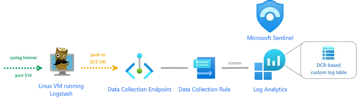
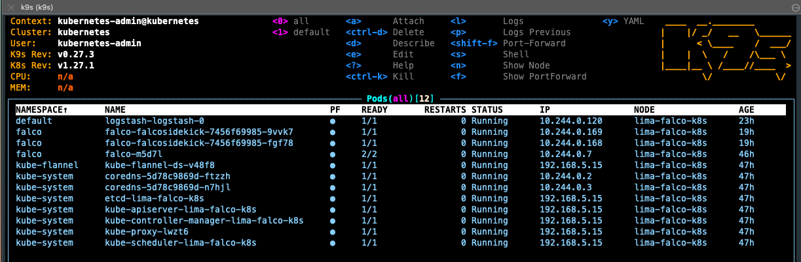

## ps-cloud logstash



**Logstash container with the required plugins to push to Azure Sentinel**

## Getting Started

Pre requisites:

```shell
brew install lima
brew install helm
brew install k9s
```

You can reference the worklows.garden.yaml in the archived POC for various helm chart set ups:
```shell
git clone org-118997105@github.com:portswigger-cloud/saas-platform-poc.git
```

Step 1:

Set up the local kuberne'test cluster.

First export kubeconfig.yaml which contains certs etc into local shell:

```shell
mkdir -p "${HOME}/.lima/falco-k8s/conf"
export KUBECONFIG="${HOME}/.lima/falco-k8s/conf/kubeconfig.yaml"
limactl shell falco-k8s sudo cat /etc/kubernetes/admin.conf >$KUBECONFIG
chmod 0600 ${KUBECONFIG}
```

Then start the k8s container:

```shell
limactl start --name=falco-k8s template://k8s --tty=false
```

List containers:

```shell
limactl list
```

Next install falco and logstash:
To run falco on mac, we set this driver: modern-bpf. We also set 'enabled: true' in falco.yaml to ensure falcosidekick is installed.

```shell
helm repo add falcosecurity https://falcosecurity.github.io/charts
helm install -f falco.yaml falco falcosecurity/falco --namespace falco --create-namespace
```

Then add and install the logstash container:
```shell
helm repo add elastic https://helm.elastic.co
helm install -f logstash.yaml logstash elastic/logstash --namespace observability --create-namespace
```
You can release new versions of the chart like this:
```shell
helm upgrade -f logstash.yaml logstash elastic/logstash --namespace observability --create-namespace
```

Voila! If you now jump onto the cluster with k9s you should see an up and running falco and logstash, where logstash will be listening for logs from falco and forwarding them to Azure Sentinel.



Now we have the option to generate dummy events in falco to test the log flow.
! Event generator is noisy so stop it swiftly or you'll end up drowning in logs.

Start generating events:
```shell
helm upgrade --install --atomic event-generator falco-security/event-generator --namespace event-generator --create-namespace --set config.actions=""
```

Stop generating events:
```shell
 helm uninstall -n event-generator event-generator
 ```
